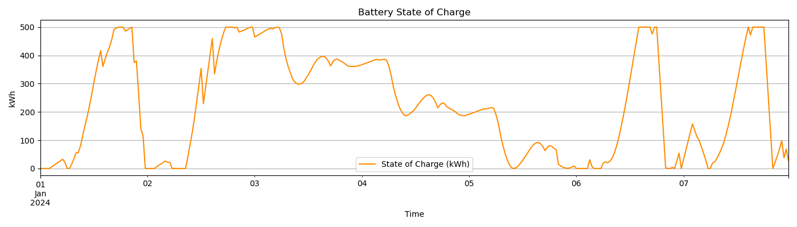
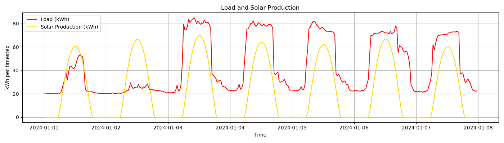
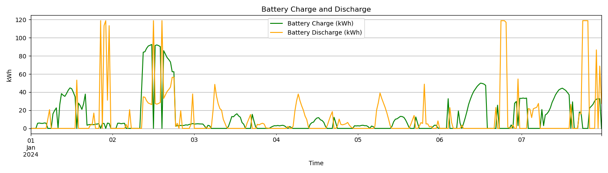
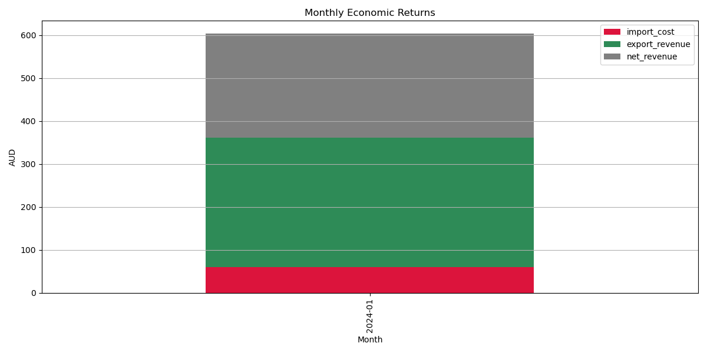
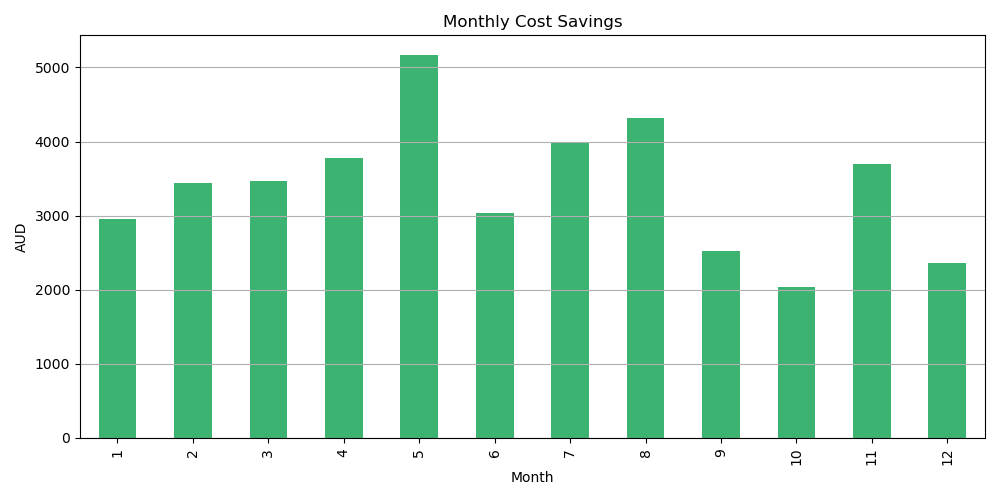

# Gridcog - Optimisation test - April 2025 - Sam MacIntyre

## Problem context

- Customer in **VIC, Australia** considering intalling *250 kW/500 kWh battery and solar panel* to reduce energy costs on an office building
- Peak power charges apply, $12/kW on **weekdays**, 3$/kW on **weekends**. Power calculated by averaging half-hourly energy import values.
- We will assume equal charge and discharge efficiency of **$\eta = 0.95$**


## Repository structure
```
├── README.md
├── data
│   ├── data_job_test.pdf
│   ├── load_data.csv
│   ├── market_data.csv
│   └── solar_data.csv
├── environment.yml
├── results
│   ├── charge_discharge.png
│   ├── battery_operation_timeseries.csv
│   ├── import_export.png
│   ├── load_solar.png
│   ├── monthly_cost_summary.csv
│   ├── monthly_returns.csv
│   ├── monthly_returns.png
│   ├── monthly_savings.png
│   ├── net_grid_flow.png
│   ├── net_load.png
│   ├── processed_load.csv
│   ├── processed_market.csv
│   ├── processed_solar.csv
│   └── soc.png
├── results_1_week
├── src
│   ├── data_loader.py
│   ├── main.py
│   ├── model_validation.py
│   ├── network_setup.py
│   ├── optimizer.py
│   └── results.py
└── validation
    └── battery_check_plot.png
```

## Setup and usage

### Create and Activate Conda Environment


```bash
# Create a new environment from the environment.yml file
conda env create -f environment.yml

# Activate the environment
conda activate test_env
```

### Run the Model

```bash
python src/main.py
```

This will:
- Run the battery optimization model.
- Generate result plots and data under the `results/` directory.
- Save monthly cost summaries to CSV.
- Save validation outputs to `validation/´ directory

## Data processing steps

1. Firstly, given 2024 is a leap year, for simplicity we do not consider February 29 in the analysis
2. All data is converted to GMT+10 timezone
3. If necessary, data is mean resampled to 30m intervals
4. Timezone localisation dropped for input into model
5. In load data case, first two entries moved to end of dataset due to timezone shift

## Modelling approach

The **MILP** is set up using the linopy package

1. Firstly set up variables for battery state of charge, battery charge power, battery discharge power, peak weekday power, peak weekend power, grid export power and grid import power.
2. Then add constraints for:
   - Battery state of charge update
   - Power balance
   - Max grid export limit
   - Monthly max peak power values
3. I have demonstrated how to add binary constraints to ensure that the battery does not charge or discharge simultaneously, but have deactivated them as the run time increased significantly.
4. Objective function which includes grid import costs, grid export revenues and peak monthly power values is added.
5. Model is solved by HIGHs solver and results extracted


### Key constraints

#### 1. Power Balance

$$
\text{import}_t - \text{export}_t + \text{discharge}_t - \text{charge}_t =
\text{load}_t - \text{solar}_t
$$

#### 2. State of Charge (SOC)

$$
\text{SOC}_{t+1} = \text{SOC}_t + \eta \cdot \text{charge}_t -
\frac{\text{discharge}_t}{\eta}
$$

Where  $\eta$ is the battery efficiency.

#### 3. Export Limit

$$
\text{export}_t - \text{discharge}_t  \leq
\text{solar}_t
$$

---


### Objective Function

The total cost is:

$$
\text{Total Cost} = \sum_t{\text{import price}_t \cdot \text{import}_t} - \sum_t{\text{export price}_t \cdot \text{export}_t} + 12 \cdot \sum_m{\max{\text{weekday import price}_m}} + 3 \cdot \sum_m{\max{\text{weekday import price}_m}}
$$


## Outputs - 1 week model

To see more clearly the optimised behaviour, we can show the results from a 1 week run of the model, before presenting the full results.

- **Battery State of Charge Over Time**

  

- **Load and Solar Production**

  

- **Battery Charge/Discharge Behavior**

  


From this small sample, we can verify that the model is behaving sensibly, displaying:
- Cyclic state-of-charge of the battery
- Charge/discharge behaviour linked to state-of-charge
- Charging greater when net load is lower

However, as mentioned previously, the model allows simultaneous charge and discharge which is unrealistic.

## Outputs - 1 year horizon


### Monthly Revenue Breakdown




### Monthly Cost Savings




## Summary CSVs

- [Monthly Revenues Summary](results/monthly_returns.csv)
- [Monthly Cost Breakdown](results/monthly_cost_summary.csv)
- [Battery State of Charge and Charge/Discharge](results/battery_operation_timeseries.csv)

## Conclusions

- Adding the battery and solar panel generates **significant cost savings** and generates **extra revenue**:
    - Average of 3400 AUD/month and a total of 40796 AUD in total over the year.
    - Average monthly net revenues of 1624 AUD/month and a total of 19483 AUD/year
 

## Model verification

To verify the model outputs, various checks were performed to ensure the it is behaving as expected:
1. Check battery capacity is not exceeded or negative
2. Check battery does not discharge when empty
3. Check simultaneous charge and discharge (not respected in simplified case)
4. Plot first two days of operation to check for anomalies

## Model limitations and improvements

Possible limitations to the model and improvements that could be considered:
- Add in the binary constraints to restrict simultaneoous charge and discharge
- Add a grid import limit
- Consider discounting and battery operational and capital cost in financial calculations
- No battery degradation considered
- No ramping, delay or state of charge degradation considered
- No minimum state of charge required
- Model assumes perfect foresight and captures no real world uncertainty


